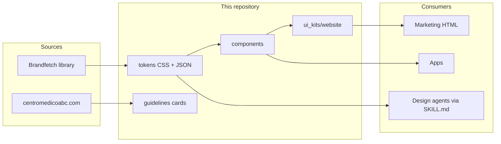

# Centro Médico ABC Design System

| Field | Value |
| --- | --- |
| Status | Draft |
| Date | 2026-08-15 |
| Audience | Product, design, and engineering building official Centro Médico ABC surfaces |
| Sources | https://brandfetch.com/centromedicoabc.com; https://centromedicoabc.com |

## Overview

Centro Médico ABC needs one tokenized visual language so web, app, and campaign surfaces stay on the public identity. This pack turns the Brandfetch extract (brand colors, type roles, official lockups) plus the live site voice into CSS variables, W3C tokens, guideline cards, and a small UI kit.

Folder contract matches the Médica Sur / RIMOV design-system skill: `tokens/` → `guidelines/` → `components/` → `ui_kits/`, plus `SKILL.md`.

## Background and motivation

The live site at centromedicoabc.com already carries the human-figure mark, Lochmara blue, and the line *La vida nos une*, but it is not tokenized. Brandfetch is the structured library (Lochmara, Cod Gray, Flesh; Myriad-Pro + system UI). Without a repo, new pages drift between #0077C8 and the favicon fill #0275C8 and invent warm beiges.

## Goals and non-goals

**Goals**

- Single source of truth for the Brandfetch palette and official lockups.
- Spanish-first voice and contrast rules that hold in a hospital UI.
- Drop-in CSS and a static specimen with no build step.
- GitHub-ready layout for a private repository.

**Non-goals**

- Replacing the production CMS or patient portals.
- A full Storybook / published npm package in v1.
- Inventing extra brand colors or redrawing the mark.
- Treating #E03C31 (detected on the live site) as a brand color.

## Proposed design



### Color

| Token | Name | Hex | RGB | HSL | CMYK | Use |
| --- | --- | --- | --- | --- | --- | --- |
| `--lochmara` | Lochmara | `#0077C8` | 0, 119, 200 | 204, 100, 39 | 100, 40, 0, 22 | Marca, vínculos, CTA primario |
| `--cod-gray` | Cod Gray | `#161616` | 22, 22, 22 | 0, 0, 9 | 0, 0, 0, 91 | Texto, wordmark oscuro, chrome |
| `--flesh` | Flesh | `#FECDA5` | 254, 205, 165 | 27, 98, 82 | 0, 19, 35, 0 | Tintes y superficies. Nunca texto de cuerpo sobre blanco. |

<strong>Lochmara</strong> es el primario (AA sobre blanco). <strong>Cod Gray</strong> es tinta y chrome oscuro. <strong>Flesh</strong> es acento de superficie — falla AA como texto sobre blanco. No usar el rojo del sitio (#E03C31) como color de marca; si aparece, queda como urgente de sistema.

### Type

- Display: Myriad Pro. Stand-in: Source Sans 3.
- Body: system UI (`-apple-system`).
- Kickers: 12px, tracking 0.12em, uppercase, Flesh on dark or Lochmara on light.

### Logo

Use `abc-logo-blue.svg` on light chrome and `abc-logo-white.svg` on Lochmara or Cod Gray. The human figure favicon (`abc-favicon.svg`) is the compact mark. Do not recolor the figure to Flesh.

### Components (v1)

Button (primary / outline / accent / urgent), Badge, Service card, Metric, Topbar, Footer.

## API / interface changes

```css
@import "centro-medico-abc-design-system/styles.css";
```

React primitives under `components/` are unbundled JSX. No npm publish in v1 (`private: true`).

## Data model

W3C design tokens in `tokens/tokens.json`. CSS is the runtime contract.

## Alternatives considered

1. **Tokens-only repo** — too thin for agents and designers.
2. **Full Storybook + npm** — correct later, too much ceremony before font licensing is settled.
3. **This pack (chosen)** — same shape as Médica Sur, previewable as static HTML, uploadable today.

## Security and privacy

- No patient data in this repo.
- Brand marks are trademarked; `LICENSE` covers code only.
- Public switchboard / WhatsApp numbers only.

## Observability

Open `index.html` after token edits. Check contrast rules in `guidelines/accessibility.html`.

## Rollout

1. Publish this repository as private.
2. Marketing pages import `styles.css`.
3. Add licensed headline files when legal provides them.
4. Optional later: token build and Figma bind.

## Open questions

1. Confirm Myriad Pro licensing and whether Source Sans 3 is acceptable until files arrive.
2. Confirm whether investor / foundation pages share this system.
3. Confirm ConsultABC price and hours as content, not tokens.

## Key decisions

- **Brandfetch hex values are canonical.** #0077C8 not #0275C8, except as a documented logo-fill alias.
- **Flesh is supporting only.** Contrast drives that rule.
- **Source Sans 3 is a documented stand-in** for Myriad Pro.
- **Static HTML specimen** so the zip works the minute it is cloned.
- **Code MIT / marks reserved.**

## PR plan

### PR 1 — Tokens and assets

- **Files:** `tokens/*`, `assets/**`, `styles.css`, `NOTICE.md`
- **Depends on:** none
- **Change:** land canonical colors, type stacks, official lockups.

### PR 2 — Guidelines and specimen

- **Files:** `guidelines/*`, `index.html`, `thumbnail.html`
- **Depends on:** PR 1
- **Change:** color/type/logo cards and the catalog page.

### PR 3 — Components and marketing kit

- **Files:** `components/**`, `ui_kits/website/*`
- **Depends on:** PR 2
- **Change:** buttons, cards, chrome, landing recreation.

### PR 4 — Agent skill and docs

- **Files:** `SKILL.md`, `README.md`, `docs/DESIGN.md`, `CONTRIBUTING.md`
- **Depends on:** PR 3
- **Change:** make the pack consumable by humans and design agents.

## References

- https://brandfetch.com/centromedicoabc.com
- https://centromedicoabc.com
